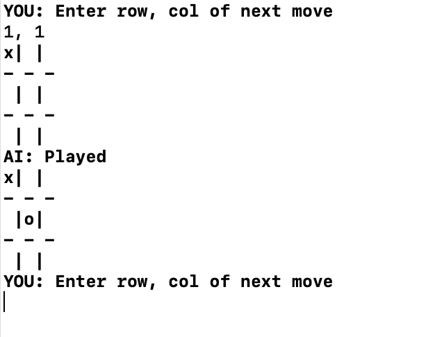

# Tic Tac Toe AI From the Ground Up

A command line Tic Tac Toe AI I built using the minimax algorithm. Try and beat it, you can't!

## Why?

This was a great project to improve my skills in C/C++ and with the implementation of more complicated algorithms.  I made it a challenge by writing 100% of the core minimax algorithm myself, no external math libraries or tutorials. I also focused on code organization and structure, as well as the use of more modern C++ language features.

## How?

First, the AI builds a tree of all possible moves and responses to its moves that can be made. Then, it performs a breadth first search on this tree using a utility function (a way of scoring the board state). It assumes that its opponent will always make the move which minimizes utility the most. The moves that lead to board states which, down the line, maximize the utility for the AI will be chosen. 

